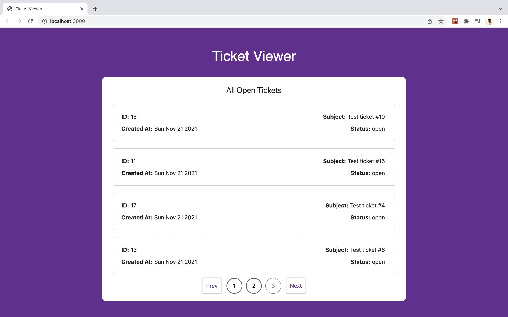

# Ticket-Viewer

A full stack application with React at front end and node with express at the backend.
Jest with React testing library for UI unit testing.

**Note: To get the list of tickets please replace your credentials in the config file of the BackEnd folder. Existing are the wrong credentials so it will throw error if you run the app.**

### Requirement: 
Node 
Git 

## Project Setup:
1. Clone the repo from the below URL
https://github.com/adarshpatil36/Ticket-Viewer.git
2. Navigate to both FrontEnd and BackEnd folders and open terminal to install node packages.
3. run `npm install` or `yarn install` in the respective folders.

## Start the Backend server:
1. Navigate to the BackEnd folder.
2. Run the below command to start the server. 
node server.js
3. Hit http://localhost:3001 and you should be able to see the `"Server started successfully and is running"`

##  Start the Frontend server:
1. Navigate to the FrontEnd folder.
2. Run the below command to start the server. 
npm start
3. Hit http://localhost:3000 and you should be able to see the application running.

## Run UI Unit test cases:
To run the UI test cases and to see the code coverage report run the below command: 
`npm-test-coverage` 

## Application UI

    
    <h3 align="center">App UI</h3>
  

